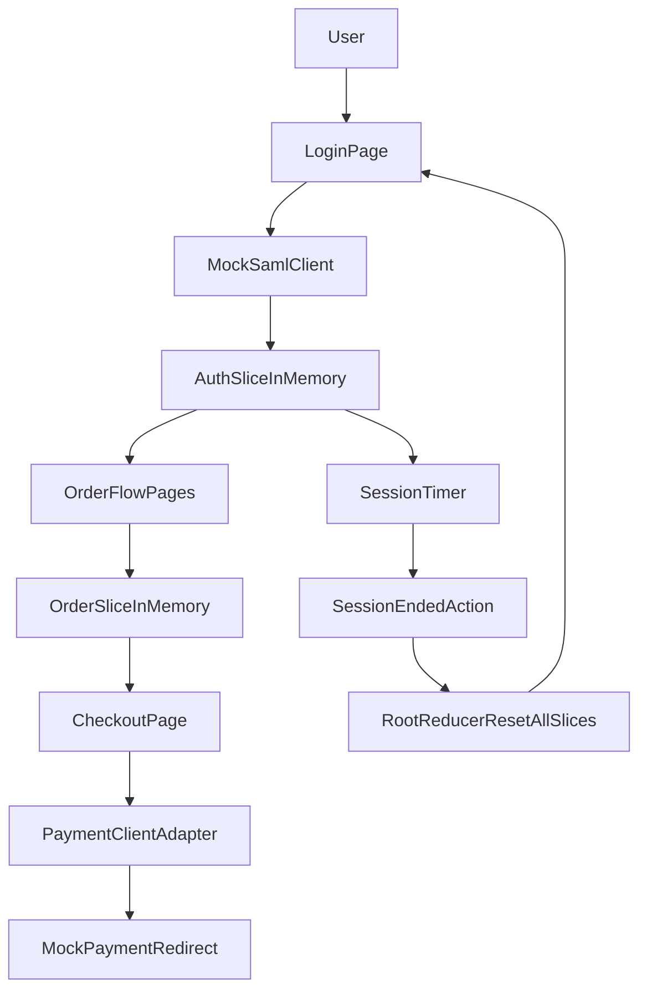

# Phase 1 Plan: Frontend Session-Only Flow

## Goal

Create the first deliverable as a frontend-only app that proves the core requirements:

- Mock SAML-style login/logout flow
- Certificate selection and multi-step order entry
- No PII persistence (memory-only Redux state)
- Automatic state wipe on logout/session-expiry/refresh
- Checkout handoff contract ready for backend integration

## Scope for this phase

- Build only Next.js + JavaScript + Tailwind + Redux Toolkit in this repository.
- Keep backend/payment/VERA calls mocked behind API service adapters.
- Establish architecture so later backend integration is plug-and-play.

## Planned project structure

- `[c:/Users/ManojAnkireddy/Documents/redux--mini-project/package.json](c:/Users/ManojAnkireddy/Documents/redux--mini-project/package.json)`
- `[c:/Users/ManojAnkireddy/Documents/redux--mini-project/src/app/layout.js](c:/Users/ManojAnkireddy/Documents/redux--mini-project/src/app/layout.js)`
- `[c:/Users/ManojAnkireddy/Documents/redux--mini-project/src/app/page.js](c:/Users/ManojAnkireddy/Documents/redux--mini-project/src/app/page.js)`
- `[c:/Users/ManojAnkireddy/Documents/redux--mini-project/src/app/login/page.js](c:/Users/ManojAnkireddy/Documents/redux--mini-project/src/app/login/page.js)`
- `[c:/Users/ManojAnkireddy/Documents/redux--mini-project/src/app/order/page.js](c:/Users/ManojAnkireddy/Documents/redux--mini-project/src/app/order/page.js)`
- `[c:/Users/ManojAnkireddy/Documents/redux--mini-project/src/app/checkout/page.js](c:/Users/ManojAnkireddy/Documents/redux--mini-project/src/app/checkout/page.js)`
- `[c:/Users/ManojAnkireddy/Documents/redux--mini-project/src/store/store.js](c:/Users/ManojAnkireddy/Documents/redux--mini-project/src/store/store.js)`
- `[c:/Users/ManojAnkireddy/Documents/redux--mini-project/src/store/slices/authSlice.js](c:/Users/ManojAnkireddy/Documents/redux--mini-project/src/store/slices/authSlice.js)`
- `[c:/Users/ManojAnkireddy/Documents/redux--mini-project/src/store/slices/orderSlice.js](c:/Users/ManojAnkireddy/Documents/redux--mini-project/src/store/slices/orderSlice.js)`
- `[c:/Users/ManojAnkireddy/Documents/redux--mini-project/src/store/slices/sessionSlice.js](c:/Users/ManojAnkireddy/Documents/redux--mini-project/src/store/slices/sessionSlice.js)`
- `[c:/Users/ManojAnkireddy/Documents/redux--mini-project/src/store/rootReducer.js](c:/Users/ManojAnkireddy/Documents/redux--mini-project/src/store/rootReducer.js)`
- `[c:/Users/ManojAnkireddy/Documents/redux--mini-project/src/lib/api/paymentClient.js](c:/Users/ManojAnkireddy/Documents/redux--mini-project/src/lib/api/paymentClient.js)`
- `[c:/Users/ManojAnkireddy/Documents/redux--mini-project/src/lib/auth/mockSamlClient.js](c:/Users/ManojAnkireddy/Documents/redux--mini-project/src/lib/auth/mockSamlClient.js)`

## Implementation steps

1. Initialize frontend baseline

- Scaffold Next.js (App Router), JavaScript, Tailwind.
- Add Redux Toolkit + React-Redux.
- Configure production-safe store defaults (`devTools` disabled in prod).

1. Implement session-only state model

- Define `auth`, `order`, and `session` slices.
- Create global `sessionEnded` action that resets all slices to initial state.
- Keep state only in memory; do not add persistence libraries.

1. Add mock SAML flow

- Implement login page with "Sign in (Mock SAML)" action.
- Simulate assertion success and set authenticated session state.
- Implement logout that dispatches full state reset and route redirect.

1. Build certificate order journey

- Step 1: certificate selection.
- Step 2: applicant/order fields.
- Step 3: review screen with validation summary.
- Keep all entered values strictly in Redux memory.

1. Add session expiry and forced clear

- Implement idle timeout/session timer in `sessionSlice` or listener middleware.
- On expiry: dispatch `sessionEnded`, redirect to login, show "Session expired" message.
- Ensure page refresh naturally loses state and restarts flow.

1. Add checkout handoff contract (mock)

- Create `paymentClient.createPaymentSession(orderPayload)` adapter.
- Return mock redirect URL + transaction ID.
- Route to checkout status page prepared for future backend polling.

1. Hardening checks for PII handling

- Verify no PII in URL/query params.
- Verify no local/session storage writes.
- Remove/avoid sensitive console logs.
- Add a short developer checklist in README for compliance guardrails.

1. Validate phase acceptance

- Manual test scenarios: login, order entry, checkout mock, logout, timeout, refresh-loss.
- Confirm all flows clear data when session ends.

## Data/session flow

## Exit criteria for Phase 1

- Working frontend journey from login to checkout mock.
- No browser persistence of form/order PII.
- State fully cleared on logout and session expiry.
- Clear seam points ready for Phase 2 backend/payment/VERA integration.

